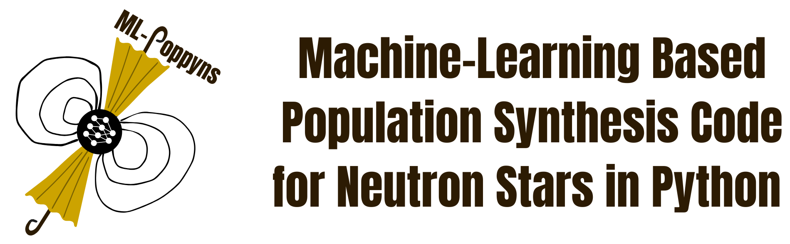
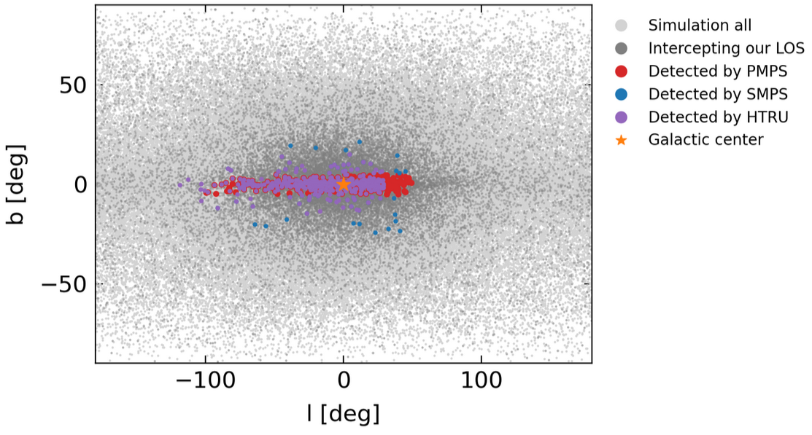
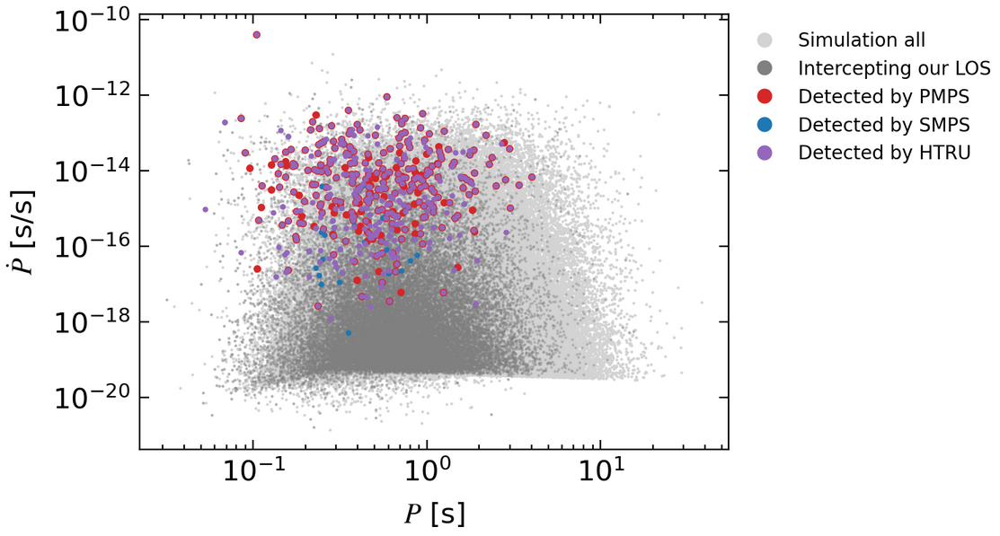

# 

<p align="center">
  
  <br>
  <em></em>
</p>

## Overview

Our population synthesis framework models the birth properties and evolution of the population of isolated Galactic 
neutron stars. The population synthesis is integrated with a deep learning pipeline to perform parameter 
inference and constrain the neutron stars' physical properties.

We can simulate a population of neutron stars and model their detection across three different surveys performed with 
Murriyang, the Parkes Radio Telescope, with just a few steps:

```python
import argparse
from mlpoppyns.simulator.config_simulator import cfg
from mlpoppyns.simulator.simulate_population_full import simulate_population

# Setting up some simulation parameters.
cfg["NS_number"] = 300000
cfg["t_age_max"] = 3.0e7
cfg["B_initial_log10_mean"] = 13.1
cfg["B_initial_log10_sigma"] = 0.45
cfg["P_initial_log10_mean"] = -1.0
cfg["P_initial_log10_sigma"] = 0.38

simulation_args = argparse.Namespace(
  save_dir="output_dir",
  parameter_override=None,
)
simulate_population(simulation_args)
```
These few lines of code will output synthetic pulsars detected with the following surveys:

1. the Parks Multibeam Pulsar Survey (PMPS; [Manchester et al. 2001](https://ui.adsabs.harvard.edu/abs/2001MNRAS.328...17M/abstract), [Lorimer et al. 2006](https://ui.adsabs.harvard.edu/abs/2006MNRAS.372..777L/abstract)),
2. the Swinburne Parkes Multibeam Pulsar Survey (SMPS; [Edwards et al. 2001](https://ui.adsabs.harvard.edu/abs/2001MNRAS.326..358E/abstract), [Jacoby et al. 2009](https://ui.adsabs.harvard.edu/abs/2009ApJ...699.2009J/abstract)),
3. the mid- and low-latitude High Time Resolution Universe survey (HTRU; [Keith et al. 2010](https://ui.adsabs.harvard.edu/abs/2010MNRAS.409..619K/abstract)).

The distributions of these pulsars in the sky and in the $P-\dot{P}$ plane are as follows:




!!! example

    More details on this simulation can be found in the tutorial 
    `tutorials/tutorial_notebooks/00_getting_started.ipynb`.

## Repository structure

!!! tip

    We recommend you read through this page to familiarize yourself with the structure of the code elements before
    moving on to the [Getting started](basics/getting_started.md) page.

### Main code modules

The repository is structured in a modular way to allow for easy adjustments and additions as we continue to improve our software package.
The main folder is `mlpoppyns` which contains three subfolders: `simulator`, `generator`, and `learning`.

* The `simulator` subfolder contains all the modules and scripts necessary to simulate a population of synthetic 
  neutron stars. We group modules according to their physics, i.e., separating those that are associated with the 
  dynamical evolution, the magneto-rotational evolution, the emission in different electromagnetic wavelengths and the 
  modelled surveys.

* The `generator` subfolder acts as the link between the physics and the machine-learning algorithms. It contains all 
  the modules and scripts necessary to represent our mock neutron star population in a way that is suitable for the
  machine-learning pipeline. We can, for example, represent the stars' properties as density and feature maps.

* The `learning` subfolder contains all the modules and scripts necessary for the machine-learning pipeline, including
  model architectures, initialization techniques, loss function definitions, training schemes and so on.

### Example data

The `data` folder contains various subfolders with example data created by running different simulator scripts, the 
generator script and the training and inference scripts, an `observations` subfolder and a `paper_results` subfolder.
Each directory contains a `README.md` file with instructions on how to produce a specific dataset.

!!! note

    All the simulation examples provided in the `data` directory were computed using the default parameters 
    specified in the configuration file `mlpoppyns/simulator/config_simulator.py`.

* The `example_generator_magrot` subfolder contains an example dataset of feature maps from simulated populations.

* The `example_generator_observed` subfolder contains an example dataset of feature maps from the observed pulsar 
  population in the [ATNF catalog](https://www.atnf.csiro.au/research/pulsar/psrcat/) and [Meerkat TPA program](https://ui.adsabs.harvard.edu/abs/2023MNRAS.520.4582P/abstract).

* The `example_inference_nn` subfolder contains the results of an inference run with a convolutional neural network
  (CNN) on some test simulated data.

* The `example_inference_sbi` subfolder contains the results of an inference run with sbi on some test simulated data.

* The `example_learning_nn` subfolder contains the results of a training run with a CNN on some training simulated data.

* The `example_learning_sbi` subfolder contains the results of a training run with sbi on some training simulated data.

* The `example_posterior_samples_harmonic` subfolder contains unnormalized posterior samples from SNLE training to be 
   used with the Harmonic package for model comparison.

* The `example_simulation_dyn` subfolder contains the results of the dynamical evolution of a population of neutron 
  stars obtained by running the script `mlpoppyns/simulator/simulate_population_dyn.py`.

* The `example_simulation_full_edm` subfolder contains the results of a full simulation (dynamical + magneto-rotational
  evolution + detection) of a population of neutron stars obtained by running the script 
  `mlpoppyns/simulator/simulate_population_full.py` and by using the `mlpoppyns/simulator/initial_population_edm.py` 
  module to set up the initial conditions.

* The `example_simulation_full_sam` subfolder contains the results of a full simulation (dynamical + magneto-rotational
  evolution + detection) of a population of neutron stars obtained by running the script
  `mlpoppyns/simulator/simulate_population_full.py` and by using the `mlpoppyns/simulator/initial_population_sam.py` 
  module to set up the initial conditions.

* The `example_simulation_helper_magrot` subfolder contains the results of 20 simulations obtained by running the 
  script `utilities/experiment_helpers/run_simulation_set.py` and using the `mlpoppyns/simulator/simulate_population_magrot_det.py` simulator.

* The `example_simulation_magrot_det` subfolder contains the results of a simulation of magneto-rotational evolution 
  and detection of a population of neutron stars obtained by running the script
  `mlpoppyns/simulator/simulate_population_magrot_det.py`.

* The `observations` subfolder contains catalogs with observed data.

* The `paper_results` subfolder contains data results for our publications.

### Documentation files

The folder `docs` contains all the necessary files to produce the documentation.

### Plots from related publications

The `paper_plots` folder contains the notebooks to generate the plots and figures in our papers:

* Analyzing the Galactic Pulsar Distribution with Machine Learning, [Ronchi et al. 2021](https://ui.adsabs.harvard.edu/abs/2021ApJ...916..100R/abstract)

* Isolated Pulsar Population Synthesis with Simulation-based Inference, [Graber et al. 2024](https://ui.adsabs.harvard.edu/abs/2024ApJ...968...16G/abstract)

* Radio pulsar population synthesis with consistent flux measurements using simulation-based inference, [Pardo-Araujo et al. 2025](https://ui.adsabs.harvard.edu/abs/2025A%26A...696A.114P/abstract)

### Tutorials

The directory `tutorials` contains two subfolders with jupyter notebooks with examples to run the simulator, generator 
and learning scripts and analyze the simulations output.

* `analysis_notebooks` contains some analysis Jupyter notebooks that can be used to plot the distributions and features 
  of a simulated population of neutron stars as well as its evolution in time. The main purpose of these notebooks is 
  the ability to check the output of the physical models used in the simulations and to compare a mock population with 
  the real distribution of observed pulsars.

* The `tutorial_notebooks` subfolder contains some notebooks to launch simple examples of the simulator, generator 
  and learning scripts. 

!!! tip

    For instructions on how to use the tutorials, see the [simulator tutorial](tutorials/simulator_tutorial.md) and 
    so on, once you have worked through the [Getting started](basics/getting_started.md) page.

### Useful Python scripts

The directory `utilities` contains some additional python modules and scripts for profiling our code, running 
simulations at our computing cluster at PIC, launching several simulations automatically and performing a parameter 
sweep, sampling distributions or dataframes, performing statistical analysis and plotting settings.

## Citation

If you use ML-Poppyns in your research, we kindly ask you to:

* Cite the following publications in the text:

  * Analyzing the Galactic Pulsar Distribution with Machine Learning, [Ronchi et al. 2021](https://ui.adsabs.harvard.edu/abs/2021ApJ...916..100R/abstract)

  * Isolated Pulsar Population Synthesis with Simulation-based Inference, [Graber et al. 2024](https://ui.adsabs.harvard.edu/abs/2024ApJ...968...16G/abstract)

  * Radio pulsar population synthesis with consistent flux measurements using simulation-based inference, [Pardo-Araujo et al. 2025](https://ui.adsabs.harvard.edu/abs/2025A%26A...696A.114P/abstract)

* Add the following sentence in the acknowledgment section of your publication:
"ML-Poppyns has been funded by the European Research Council via the ERC Consolidator grant 'MAGNESIA' (No. 817661; PI: N. Rea)."

## Contacts

If you encounter any issues or have questions, please feel free to email us at ml-poppyns@ice.csis.es.